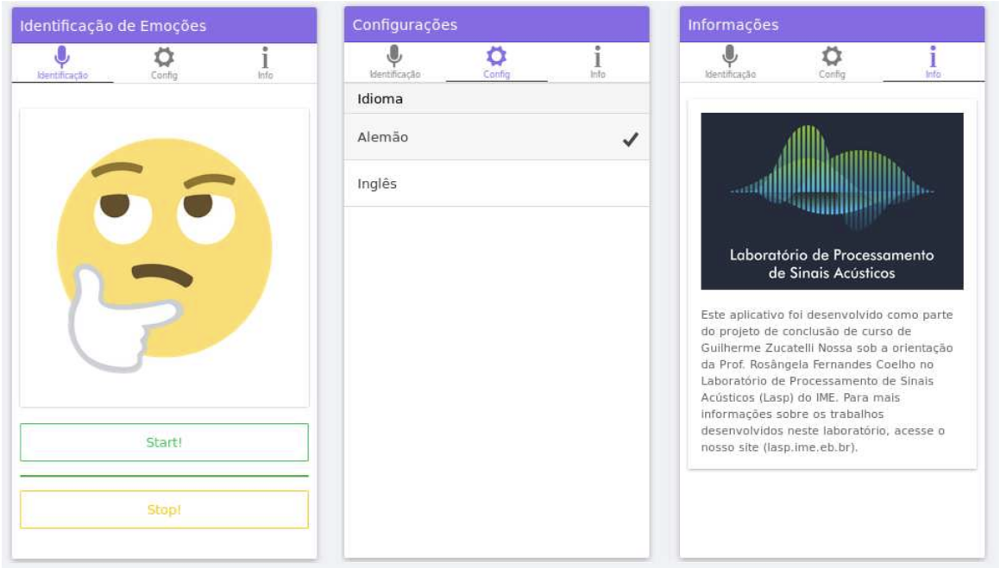
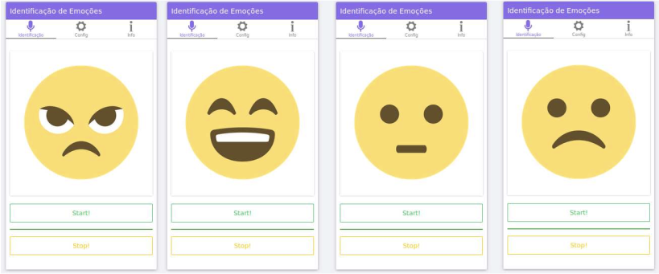

# IDEA - Acoustic Emotion IDentification App
The **IDEA** App is the ***ID**entificador de **E**moções **A**cústicas (in original Portuguese)*.

This is a PoC <a href="https://ionicframework.com" target="_blank"> IONIC </a> App which design to identify emotions (happiness, anger, neutral and sadness) in speech [1] [2].

The  **IDEA** App was an integral part of my undergraduate research and undergraduate thesis during the Bachelor in Electronic Engineering at the Military Institute of Engineering (IME).

The undergraduate assistant research was conducted at the Laboratory of Acoustic Signal Processing (LASP) in the mains topics of: acoustic emotion identification, speech enhancement, speaker recognition and speech intelligibility.

**Awards:**
- Recipient of the CREA-RJ Award, given annually to the best undergraduate thesis among all graduating electronic engineers in Rio de Janeiro by the Regional Counsil of Engineering and Agronomy. (2017)
- Recipient of the Best Undergraduate Research Award, given at the annually IME Undergraduate Research Meeting to best presented research. (2016)

### App Interface Snapshots
Main interfaces: 
- Emotion Identification
- Configuration
- Info

The PoC was developed with a simple design of `START` / `STOP` buttoms that activate/deactivate the algorithms of (1) audio capture, (2) pre-processing, (3) Mel-Frequency Cepstral Coefficient (MFCC) feature extraction [3] and (4) trained stochastic Gaussian Mixture Model (GMM) inference. 

  <picture>
    
  </picture>

For each model prediction, i.e. identified emotion with maximum probability, the interface is than updated as illustrated below for either Anger, Happiness, Neutral and Sadness emotions, respectively.

  <picture>
    
  </picture>

After the `START` activation, the **IDEA** App performs 4 inferences per second for a given selected language.

---
### References
[1] Darwin, C. R. 1872. "The expression of the emotions in man and animals". London: John Murray. 1st edition.

[2] B. Wang and M. Lugger, "Emotion recognition from speech signals using new harmony features", Signal Processing, 2010.

[3] Reynolds, Douglas A., and Richard C. Rose. ”Robust text-independent speaker identification using Gaussian mixture speaker models.” IEEE transactions on speech and audio processing, 3.1, 1995.

---
**Important Note:** This repository is not maintained. 